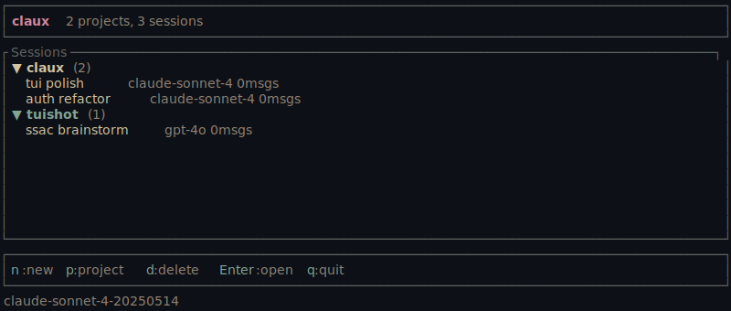
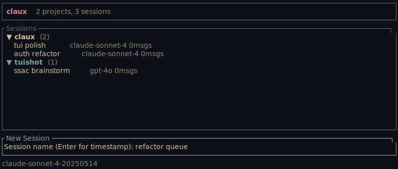

# claux

A terminal-based AI coding assistant written in Rust. Streams responses, executes tools, manages sessions, and stays out of your way.

## Features

- **Streaming chat** with tool execution (Read, Write, Edit, Glob, Grep, Bash, WebFetch, Agent)
- **Interactive permissions** — prompts before writes, `y/n/a`; type a message at the prompt instead to deny the tool and steer the model with it
- **Mid-turn steering** — type while claux is running tools and press Enter; the running tool is cancelled, remaining queued tools are skipped, and your message reaches the model immediately
- **Interrupt anywhere** — Ctrl+C during a turn cancels it cleanly (in-flight tool calls are paired with interrupted results, so the conversation stays valid); press Ctrl+C twice within 2s to quit the app (Ctrl+D still exits immediately)
- **Session persistence** — SQLite-backed with search; full transcripts including tool calls and results, so `/resume` and `--resume` restore exactly what the model saw. Histories from older versions are repaired on load
- **Compaction** — `/compact` summarizes conversation to free context
- **Model switching** — `/model <name>` mid-conversation
- **Sub-agents** — Agent tool spawns scoped sub-conversations. Sub-agents inherit the parent session's permission mode, so a sub-agent can't act with more authority than you granted the session. Because sub-agents run non-interactively, any tool the mode would prompt for is denied rather than auto-run (Plan denies all writes; Bypass allows all)
- **Auto-compact** — triggers when conversation gets large
- **Cost tracking** — per-model token usage and USD estimates
- **Prompt caching** — automatic Anthropic cache breakpoints on the system prompt and conversation, cutting input cost and latency on long sessions
- **Context assembly** — git status, CLAUDE.md, environment info in system prompt
- **TUI mode** — full-screen ratatui interface with `--tui`
- **Multi-provider** — Anthropic, OpenAI, Ollama, or any OpenAI-compatible endpoint
- **OAuth support** — can reuse existing `claude login` credentials (best-effort; see Auth)
- **Native system prompt** — claux speaks as claux; the full prompt is readable in `src/context.rs`, and what you read is what the model gets
- **Markdown rendering** — code blocks, bold, headers in the TUI

## Screenshots

The TUI in action. These are generated by [tuishot](https://github.com/ducks/tuishot)
from claux's own code — `cargo test` fails if they drift, so they can't go
stale.





## Install

```bash
# From crates.io
cargo install claux

# From source
cargo install --path .
```

Requires Rust 1.88+. A `shell.nix` is included.

## Auth

claux resolves authentication in order:

1. `api_key` in `~/.config/claux/config.toml`
2. `api_key_cmd` (shell command that returns a key)
3. `ANTHROPIC_API_KEY` environment variable
4. OAuth token from `~/.claude/.credentials.json`

If you've already run `claude login`, claux picks up those credentials automatically.

Note: the OAuth path is best-effort. claux sends its own system prompt and
identifies as claux, and Anthropic may restrict subscription OAuth tokens to
official clients. An API key (or an OpenAI-compatible endpoint) is the
supported path.

### OpenAI-compatible providers

For Ollama, vLLM, LMStudio, OpenAI, or any hosted endpoint:

```toml
model = "llama3"
openai_base_url = "http://localhost:11434/v1"
openai_provider_name = "ollama"
```

API keys via command (works with 1Password, Vault, etc.):

```toml
model = "gpt-4o"
openai_base_url = "https://api.openai.com/v1"
openai_api_key_cmd = "op read 'op://vault/OpenAI/key'"
openai_provider_name = "openai"
```

## Usage

```bash
# Interactive REPL (default)
claux

# Full-screen TUI
claux --tui

# One-shot
claux -p "explain this error"

# Resume a session
claux --resume 20260401-143022
```

## Commands

| Command | Description |
|---------|-------------|
| `/help` | Show available commands |
| `/cost` | Token usage and estimated cost |
| `/compact` | Summarize conversation to free context |
| `/model [name]` | Show or switch model |
| `/resume [id]` | List or resume past sessions |
| `/clear` | Clear screen |
| `/exit` | Exit |

## Config

Global: `~/.config/claux/config.toml`

```toml
model = "claude-sonnet-5"
permission_mode = "default"  # default | accept-edits | bypass | plan

# Project-local .claux.toml files may tighten this mode without trust, but
# cannot loosen it unless their directory is listed here or --trust-project
# is passed for the invocation. Project-local .mcp.json uses the same boundary.
trusted_projects = ["/absolute/path/to/a/trusted/project"]
```

Per-project: `.claux.toml` in the project root (overrides global).

## Permission Modes

| Mode | Reads | File edits | Bash |
|------|-------|------------|------|
| `default` | auto | prompt | prompt |
| `accept-edits` | auto | auto | prompt |
| `bypass` | auto | auto | auto |
| `plan` | auto | denied | denied |

In `accept-edits` mode, Agent, MCP, and other non-read-only tools still require
explicit approval. Approving the Agent tool authorizes its sub-agent to run its
tools without additional prompts.

## License

MIT
