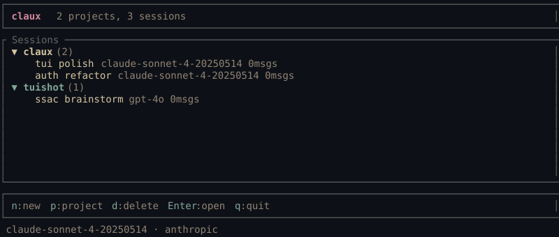
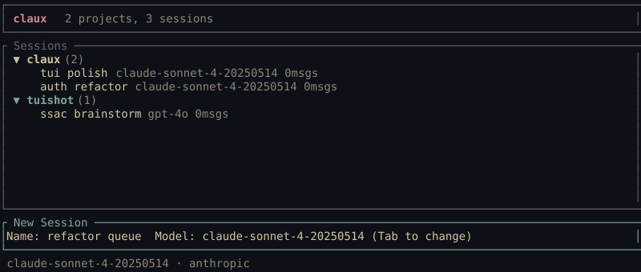

# claux

A terminal-based AI coding assistant written in Rust. Streams responses, executes tools, manages sessions, and stays out of your way.

## Features

- **Streaming chat** with tool execution (Read, Write, Edit, Glob, Grep, Bash, WebFetch, Agent)
- **Interactive permissions** — prompts before writes, `y/n/a`; type a message at the prompt instead to deny the tool and steer the model with it
- **Mid-turn steering** — type while claux is running tools and press Enter; the running tool is cancelled, remaining queued tools are skipped, and your message reaches the model immediately
- **Interrupt anywhere** — Ctrl+C during a turn cancels it cleanly (in-flight tool calls are paired with interrupted results, so the conversation stays valid); press Ctrl+C twice within 2s to quit the app (Ctrl+D still exits immediately)
- **Session persistence** — SQLite-backed with search; full transcripts including tool calls and results, so `/resume` and `--resume` restore exactly what the model saw. Histories from older versions are repaired on load
- **Safe turn checkpoints** — `/diff` shows exactly what the last turn changed; `/undo-turn` restores it only when no file has been edited since, so later human work is never overwritten
- **Compaction** — `/compact` summarizes conversation to free context
- **Model selection** — choose one configured model/provider for each new TUI session; `/model <name>` can switch model IDs on the active provider
- **Sub-agents** — Agent tool spawns scoped sub-conversations. Sub-agents inherit the parent session's permission mode, so a sub-agent can't act with more authority than you granted the session. Because sub-agents run non-interactively, any tool the mode would prompt for is denied rather than auto-run (Plan denies all writes; Bypass allows all)
- **Auto-compact** — triggers when conversation gets large
- **Cost tracking** — per-model token usage and USD estimates
- **Prompt caching** — automatic Anthropic cache breakpoints on the system prompt and conversation, cutting input cost and latency on long sessions
- **Context assembly** — git status, CLAUDE.md, environment info in system prompt
- **TUI mode** — full-screen ratatui interface with `--tui`
- **Multi-provider** — Anthropic, OpenAI, Ollama, or any OpenAI-compatible endpoint
- **Native system prompt** — claux speaks as claux; the full prompt is readable in `src/context.rs`, and what you read is what the model gets
- **Markdown rendering** — code blocks, bold, headers in the TUI

## Screenshots

The TUI in action. These are generated by [tuishot](https://github.com/ducks/tuishot)
from claux's own code — `cargo test` fails if they drift, so they can't go
stale.





## Install

```bash
# From crates.io
cargo install claux

# From source
cargo install --path .
```

Requires Rust 1.88+. A `shell.nix` is included.

## Releasing

`make release` creates and merges the dated release branch, pushes the release
commit to `main`, and waits for the exact commit's GitHub Actions CI run. The
release tag and crates.io publication only happen after the Linux, macOS, and
Windows test/build matrix succeeds.

The release command requires an authenticated [GitHub CLI](https://cli.github.com/)
with access to this repository. A failed or undiscoverable CI run stops the
release before tagging or publishing.

## First run

Create a starter configuration for Anthropic, OpenAI, OpenRouter, or Ollama,
then verify authentication, required executables, configured hooks/MCP
servers, project trust, and provider connectivity:

```bash
claux config init --provider anthropic
claux doctor

# Other examples
claux config init --provider openai --model gpt-5.6-sol
claux config init --provider openrouter --model anthropic/claude-sonnet-5
claux config init --provider ollama --model llama3
claux doctor --offline  # configuration checks without a network request
```

The generated file contains environment-variable names, never API keys, and is
created with private permissions. Run `config init` again with another provider
to add it without replacing existing settings or comments. `--force` explicitly
starts over.

The TUI opens on the session browser. Starting a session lets you choose one
named model profile; opening an existing session restores its exact provider,
endpoint, protocol, and model:

```toml
default_profile = "sonnet"

[providers.anthropic]
type = "anthropic"
api_key_env = "ANTHROPIC_API_KEY"

[providers.openrouter]
type = "openai"
base_url = "https://openrouter.ai/api/v1"
name = "openrouter"
protocol = "chat_completions"
api_key_env = "OPENROUTER_API_KEY"

[model_profiles.sonnet]
provider = "anthropic"
model = "claude-sonnet-5"
display_name = "Sonnet"

[model_profiles.gpt]
provider = "openrouter"
model = "openai/gpt-5.6"
display_name = "GPT via OpenRouter"
```

Saved sessions never contain API keys. They retain a credential-free transport
snapshot and resolve credentials from the current matching provider config or
saved environment-variable name when reopened. If that credential is no longer
available, the TUI returns to the session browser with a recovery message.

## Auth

For each named provider, claux resolves authentication in order:

1. `api_key` in its provider table
2. `api_key_cmd` (shell command that returns a key)
3. The provider's `api_key_env` environment variable

Claude Free, Pro, and Max subscription credentials are not supported. Use an
Anthropic API key or an OpenAI-compatible endpoint such as OpenRouter.

### Legacy single-provider configuration

Existing flat configuration remains supported:

```toml
model = "llama3"
openai_base_url = "http://localhost:11434/v1"
openai_provider_name = "ollama"
```

API keys via command also remain supported (works with 1Password, Vault, etc.):

```toml
model = "gpt-4o"
openai_base_url = "https://api.openai.com/v1"
openai_api_key_cmd = "op read 'op://vault/OpenAI/key'"
openai_provider_name = "openai"
```

## Usage

```bash
# Interactive REPL (default)
claux

# Full-screen TUI
claux --tui

# One-shot
claux -p "explain this error"

# Resume a session
claux --resume 20260401-143022
```

## Commands

| Command | Description |
|---------|-------------|
| `/help` | Show available commands |
| `/cost` | Token usage and estimated cost |
| `/compact` | Summarize conversation to free context |
| `/diff` | Show file changes made by the last turn |
| `/undo-turn` | Safely undo the last turn's file changes |
| `/model [name]` | Show or switch model |
| `/resume [id]` | List or resume past sessions |
| `/clear` | Clear screen |
| `/exit` | Exit |

Turn checkpoints cover Git-tracked files and non-ignored untracked files.
Ignored files and paths outside the repository are deliberately excluded.
`/undo-turn` first verifies that every affected file still matches the end of
the turn; if anything changed afterward, it refuses the entire undo.

## Config

Global: `~/.config/claux/config.toml`

```toml
default_profile = "sonnet"
permission_mode = "default"  # default | accept-edits | bypass | plan
native_tool_filesystem_policy = "workspace_only" # workspace_only | unrestricted
bash_filesystem_policy = "auto" # auto | workspace_write | unrestricted

# Project-local .claux.toml files may tighten permission and filesystem
# policies without trust, but cannot loosen them unless their directory is
# listed here or --trust-project is passed for the invocation.
# Project-local .mcp.json uses the same boundary.
trusted_projects = ["/absolute/path/to/a/trusted/project"]

[providers.anthropic]
type = "anthropic"
api_key_env = "ANTHROPIC_API_KEY"

[providers.openai]
type = "openai"
base_url = "https://api.openai.com/v1"
name = "openai"
protocol = "responses"
api_key_env = "OPENAI_API_KEY"

[model_profiles.sonnet]
provider = "anthropic"
model = "claude-sonnet-5"
display_name = "Sonnet"

[model_profiles.openai-coder]
provider = "openai"
model = "gpt-5.6-sol"
display_name = "OpenAI Coder"
reasoning_effort = "medium"

# Optional pricing overrides, in USD per million tokens. Built-in prices are
# used for known models; unknown models display "Cost: unavailable".
# [model_pricing."gpt-5.6-sol"]
# input = 5.0
# output = 30.0
# cache_read = 0.5
# cache_write = 6.25
```

Per-project: `.claux.toml` in the project root (overrides global).

### Native tool filesystem policy

`native_tool_filesystem_policy` controls Claux's built-in Read, Write, Edit,
Glob, and Grep tools. The default, `workspace_only`, resolves paths and symlinks
before allowing access and rejects paths outside the directory where Claux was
started. It also rejects search patterns which traverse to a parent directory.

Set the global value to `unrestricted` when native tools must work across the
filesystem. A project-local `.claux.toml` may tighten this policy without trust,
but may only loosen it for a trusted project.

This is application-level containment for native file tools. MCP tools are not
contained by this setting and continue to use Claux's project-trust boundary.

### Bash filesystem policy

`bash_filesystem_policy` controls operating-system containment for commands
spawned by the Bash tool:

- `auto` (the default) uses Linux Landlock workspace-write containment when
  fully available. Otherwise it emits a warning and preserves unrestricted
  behavior.
- `workspace_write` requires Linux Landlock and fails closed when the kernel
  cannot completely enforce the policy.
- `unrestricted` runs Bash with the user's normal filesystem access.

Workspace-write commands can read the filesystem but may only write beneath the
directory where Claux started, system temporary directories, `/dev/null`, and
the repository's Git metadata. Allowing temporary paths keeps compilers and
other development tools functional. Symlink traversal does not grant access to
targets outside these writable roots.

Run `claux doctor` to see the effective Bash policy on the current system.

The Bash permission prompt and `permission_mode` remain separate from
containment: approving a command authorizes it to run, but does not disable the
sandbox. Claux never retries a sandbox-denied command unrestricted. A trusted
project may explicitly select `unrestricted`; an untrusted project may only
tighten the global policy.

## Hooks

Run a command on a lifecycle event. Each `[[plugins]]` entry runs its
`command` when the matching `trigger` fires. Nothing about the command lives
in claux - it's your config, so a hook can drive anything: a status light, a
notification, a logger, a metrics counter.

```toml
[[plugins]]
name = "lamp-idle"
command = "glow-hook"
args = ["purple"]
trigger = "on_session_start"

[[plugins]]
name = "lamp-working"
command = "glow-hook"
args = ["blue"]
trigger = "on_tool_start"

[[plugins]]
name = "lamp-your-turn"
command = "glow-hook"
args = ["green"]
trigger = "on_turn_end"

[[plugins]]
name = "lamp-needs-you"
command = "glow-hook"
args = ["orange"]
trigger = "on_permission_request"
```

| Trigger | Fires when |
|---------|-----------|
| `on_context_build` | building the system prompt (stdout is injected as context) |
| `on_session_start` | a session starts |
| `on_tool_start` | a tool call begins |
| `on_tool_complete` | a tool call finishes |
| `on_turn_end` | the agent finishes a turn and control returns to you |
| `on_permission_request` | the agent blocks on a permission prompt (it needs you) |

The example above is a [glow](https://github.com/ducks/glow) status lamp: your
keyboard's RGB tracks what claux is doing. `on_context_build` is special - its
stdout is added to the system prompt; the rest are bounded side effects. Hook
commands run concurrently with a 10-second timeout and bounded captured output.

## Permission Modes

| Mode | Reads | File edits | Bash |
|------|-------|------------|------|
| `default` | auto | prompt | prompt |
| `accept-edits` | auto | auto | prompt |
| `bypass` | auto | auto | auto |
| `plan` | auto | denied | denied |

In `accept-edits` mode, Agent, MCP, and other non-read-only tools still require
explicit approval. Sub-agents inherit the parent permission mode; because they
are non-interactive, operations that would require another prompt are denied.

## Agent evaluations

Claux has fixture-driven behavioral evaluations for complete multi-round turns,
including real tool execution in isolated workspaces, permissions, steering,
file outcomes, recovery, and provider stream failures:

```bash
cargo test evals::deterministic_agent_contracts -- --nocapture
```

They require no credentials or network and run as a dedicated CI check.
An ignored paid-provider smoke test and manual workflow are also available;
see [`evals/README.md`](evals/README.md).

## License

MIT
